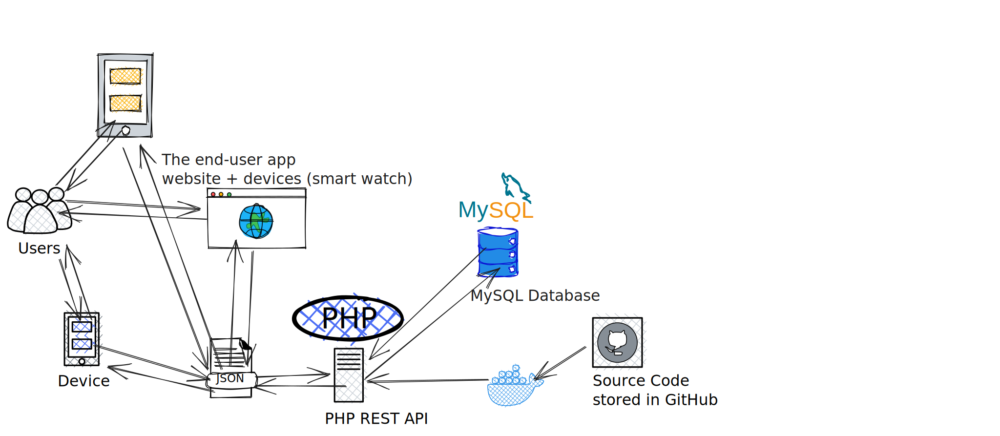

# Build a PHP RESTful API

This is the source code of my Udemy course **[Build a Modern REST API with PHP 8.2](https://www.udemy.com/course/build-modern-php-api/)** 🚀

## The course

It is indispensable to [enroll the Udemy course](https://www.udemy.com/course/build-modern-php-api/) in order to understand and setup properly this project.

## Quick Setup

* Composer & `composer install`
* Run the in-built PHP server `php -S localhost:8080`

## Author

**[Pierre-Henry Soria](https://ph7.me)**. A super passionate and enthusiastic software engineer! 😊 Also, a true cheese 🧀, dark chocolate, and espresso lover! ☕️

## License

This source code is distributed under the open-source [MIT license](https://opensource.org/licenses/MIT).
